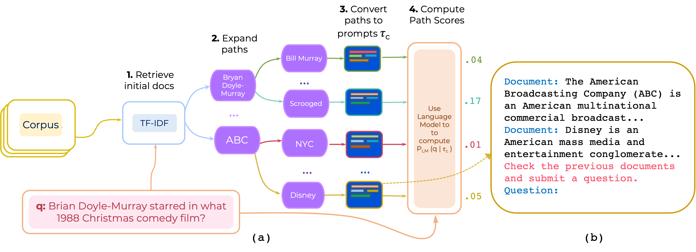

# Few-shot Reranking for Multi-hop QA via Language Model Prompting

We propose an approach for unsupervised re-ranking of multi-hop document paths for open-domain QA. PromptRank constructs a prompt that consists of **(i) an instruction** and **(ii) the path** and uses a language model to score paths as probability of generating the question given the path.




# Instructions 

#### 1. Download TF-IDF index
Download the TF-IDF retriever and database for HotpotQA provided by [PathRetriever](https://github.com/AkariAsai/learning_to_retrieve_reasoning_paths) from [this link](https://drive.google.com/open?id=1ra37xtEXSROG_f90XxR4kgElGJWUHQyM) and place its contents in `path-retriever/models`

#### 2. Install requirements 
```
pip install -r requirements.txt
```

#### 3. Downloading processed data
The HotpotQA and 2WikiMQA processed data can be downloaded from [Google Drive] The data is preprocessed by retrieving 200 top TF-IDF articles to seed up inference. (https://drive.google.com/file/d/1mI7XAdHWLhlW6fMOW3LJQMPipSmlnP67/view?usp=share_link). Then unzip the data and place the content it in ```data/```

#### 4.(a) To run PromptRank with a single instruction 
```
python run.py \
--model google/t5-base-lm-adapt \
--eval_batch_size=50 \
--max_prompt_len 600  \
--max_doc_len 230 \
--tfidf_pool_size 100  \
--n_eval_examples 1000 \
--temperature 1.0 \
--eval_data data/hotpotqa/dev.json \
--prompt_template 'Document: <P> Review previous documents and ask some question. Question:'
```

#### 4.(b) To run PromptRank with an ensemble of instructions 
```
python run.py \
--model google/t5-base-lm-adapt \
--eval_batch_size=50 \
--max_prompt_len 600  \
--max_doc_len 230 \
--tfidf_pool_size 100  \
--n_eval_examples 1000 \
--temperature 1.0 \
--eval_data data/hotpotqa/dev.json \
--instruction_template_file instruction-templates/top_instructions.txt
--ensemble_prompts 
```

#### 4.(c) To run PromptRank with a in-context learning (only two demonstrations: one bridge and one yes/no question) 
```
python run.py \
--model google/t5-base-lm-adapt \
--eval_batch_size=50 \
--max_prompt_len 600  \
--max_doc_len 230 \
--tfidf_pool_size 100  \
--n_eval_examples 1000 \
--temperature 1.0 \
--eval_data data/hotpotqa/dev.json \
--prompt_template 'Document: <P> Review previous documents and ask some question. Question:' \
--demos_ids 0,1 \ 
--demos_file data/hotpotqa/in_context_demos.json \
```
#### 4.(d) To run PromptRank with a in-context learning with demonstration ensembling (with 3 ensembles -- each having two demonstrations i.e, 6 demonstrations in total)
```
python run.py \
--model google/t5-base-lm-adapt \
--eval_batch_size=50 \
--max_prompt_len 600  \
--max_doc_len 230 \
--tfidf_pool_size 100  \
--n_eval_examples 1000 \
--temperature 1.0 \
--eval_data data/hotpotqa/dev.json \
--prompt_template 'Document: <P> Review previous documents and ask some question. Question:' \
--demos_ids 0,1 \ 
--demos_file data/hotpotqa/in_context_demos.json \
--n_ensemble_demos 3
```

**Note:** The code supports either instruction ensembling or demonstration ensembling -- not both. 

**Acknolwledgements**: We use many components from [PathRetriever](https://github.com/AkariAsai/learning_to_retrieve_reasoning_paths). So thanks to Akari Asai and others for providing their code and models.

#### Citation
If you use this code, please consider citing our paper:
```
@article{promptrank,
  title={Few-shot Reranking for Multi-hop QA via Language Model Prompting},
  author={Khalifa, Muhammad and Logeswaran, Lajanugen and Lee, Moontae and Lee, Honglak and Wang, Lu},
  journal={arXiv preprint arXiv:2205.12650},
  year={2023}
}
```
